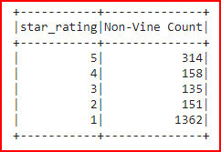

# Amazon_Vine_Analysis

## Project Overview

We have been tasked with analysing differnet Amazon reviews that have been written by members of the paid Amazon Vine program. This service allows manufactures and publishers to receive reviews for their products directly from Amazon Vine members. The clients pay a fee to Amazon and provide products directly to Amazon Vine members who are then required to publish a related product review.

Amazon has provided access to approximately 50 different datasets, each one contains specific reviews for specific product categories. We are asked to  select a dataset specifically relevant to our client which contains reviews and feedback specific to their business needs. Once we have selected the dataset, we will use PySpark to perform the ETL process to extract the dataset, transform the data, connect to an AWS RDS instance and load the transformed data into pgAdmin. Secondly, we have the choice of using PySpark, Pandas, or SQL to determine if there is any bias toward favorable reviews from Vine members in the dataset. In our case, we will be using PySpark for this section of the data analysis and then annotating a summary of the results for our client to review along with their stakeholders. The dataset we will be using from Amazon is the "Digital Software" reviews recorded by both Vine and non-Vine members.

- Deliverables:
  1. Peform an ETL function using Amazon AWS, Google Colab Notebooks and pgAdmin.
  2. Calculate matrics to determine if a paid Vine review make a difference in the percentage of 5-star reviews.

------------------------------------------------------------------------------------------------------------

## Resources
- Software: Visual Studio Code 1.56.2, Python 3.7.10, Google Collab Notebook
- Libraries: PySpark, OJS v11, PySpark v3.0.3
- Browser : Google Chrome v91.0.4472.124
- Data Source: AWS Cloude DB, PostgreSQl v12.7
- Data Client: pgAdmin v5.5
- Data : https://s3.amazonaws.com/amazon-reviews-pds/tsv/amazon_reviews_us_Digital_Software_v1_00.tsv.gz
------------------------------------------------------------------------------------------------------------

## Results

### Perform ETL on Amazon Products Reviews

- The Digital Software dataset was loaded into a singular dataframe directly from Amazon. From this master dataframe, four additional distinct dataframes were generated and loaded into 4 different SQL tables. Each table was created using a schema that matched the corresponding dataframe exactly as extracted using Google Collab notebook and PySpark.

- Likewise to the above, each dataframe was transformed into the correct format with duplicated data removed, dates re-formatted and values aggregated as necessary. Below we can see an example of the different fields associated with the vine_table and the related data.

- Finally each transformed dataframe was loaded into the corresponding postgreSQL database table. We can see the results below once the vine_table data containing 102084 records of reviews was successfully loaded.

## Determination of Bias in Vine Reviews

- For the second part of this task we are challenged to validate if there is bias associated with the reviews in our dataset. We need to understand if the results below are based on predetermined ideas or have been influenced in a certain direction to produced these results. We can conclude that the data was not altered in any way to provide a directional viewpoint nor have we forced any conclusions other that interpreting the results of the anlysis. In the summary below we have performed this interpretation and provided feedback based on the data solely.

------------------------------------------------------------------------------------------------------------

## Overall Summary

- The purpose of analysing vine reviewes is two-fold. We want to ensure that if our client is paying for the vine service and providing products to vine members for review, the actions are being carried out as expected. This process allows us to perform an audit on the resources being provided as it relates to the outcome. Secondly, we want to understand how all reviewers are rating the products produced by our client.

- From the analysis provided the following conclusions can be stated:
    - There were 2120 non-Vine and 0 Vine member reviews
    - There were 314 non-Vine and 0 Vine member 5-star reviews
    - There were 15% non_Vine and 0% Vine member reviews that were 5-star

- In Summary, since there are no reviews recorded for Vine members we cannot definitively state if there is a bias. We do not have any data to support a statement in either direction in regards to Vine members. However, for non-Vine members we can see that 15% of all reviews provided a 5-star positively biased product review based on the conclusions.

- Since we only have non-Vine reviews we can further expand on the reviews we do have by looking at all the ratings by star value for a better understanding. Below we can see a summary dataframe outlining this information which shows a breakdown by star ranking. The results below point to a more negative bias as we have large amount of non-Vine reviews pointing to 1-star rating.

------------------------------------------------------------------------------------------------------------
